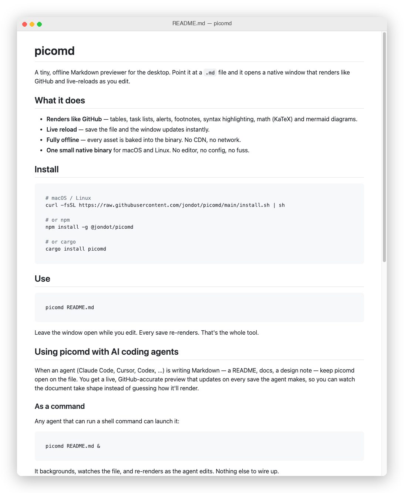

# picomd

A tiny, offline Markdown previewer for the desktop. Point it at a `.md` file and
it opens a native window that renders like GitHub and live-reloads as you edit.



## What it does

- **Renders like GitHub** — tables, task lists, alerts, footnotes, syntax
  highlighting, math (KaTeX) and mermaid diagrams.
- **Live reload** — save the file and the window updates instantly.
- **Fully offline** — every asset is baked into the binary. No CDN, no network.
- **One small native binary** for macOS and Linux. No editor, no config, no fuss.

## Install

```sh
# macOS / Linux
curl -fsSL https://raw.githubusercontent.com/jondot/picomd/main/install.sh | sh

# or npm
npm install -g @jondot/picomd

# or cargo
cargo install picomd
```

## Use

```sh
picomd README.md
```

Leave the window open while you edit. Every save re-renders. That's the whole tool.

## Using picomd with AI coding agents

When an agent (Claude Code, Cursor, Codex, …) is writing Markdown — a README,
docs, a design note — keep picomd open on the file. You get a live,
GitHub-accurate preview that updates on every save the agent makes, so you can
watch the document take shape instead of guessing how it'll render.

### As a command

Any agent that can run a shell command can launch it:

```sh
picomd README.md &
```

It backgrounds, watches the file, and re-renders as the agent edits. Nothing else
to wire up.

### As a Claude Code skill

Drop this in `.claude/skills/preview-markdown/SKILL.md` so the agent reaches for
picomd whenever you ask to preview Markdown:

```markdown
---
name: preview-markdown
description: Open a live GitHub-style preview of a Markdown file with picomd. Use when the user wants to see how a README or doc renders.
---

Open a live preview window for the Markdown file the user is working on:

    picomd "<file>" &

The window live-reloads on every save, so keep editing — it stays current.
Launch it once per file; don't relaunch on each edit.
```

### As a slash command

Or add `.claude/commands/preview.md` for an explicit `/preview`:

```markdown
Open a live picomd preview of $ARGUMENTS (default: README.md):

    picomd "${ARGUMENTS:-README.md}" &
```

Then `/preview docs/guide.md` opens the preview and your following edits show up
live.

## Platforms

macOS (Intel and Apple silicon) and Linux x86_64. Building from source on Linux
needs the GUI libraries:

```sh
sudo apt-get install -y libwebkit2gtk-4.1-dev libgtk-3-dev
```

## License

MIT
